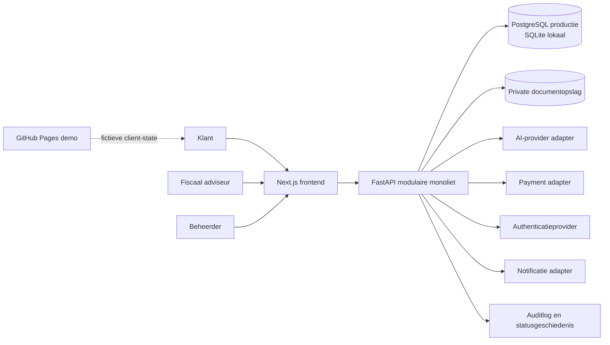
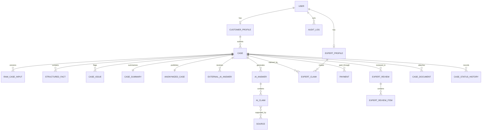
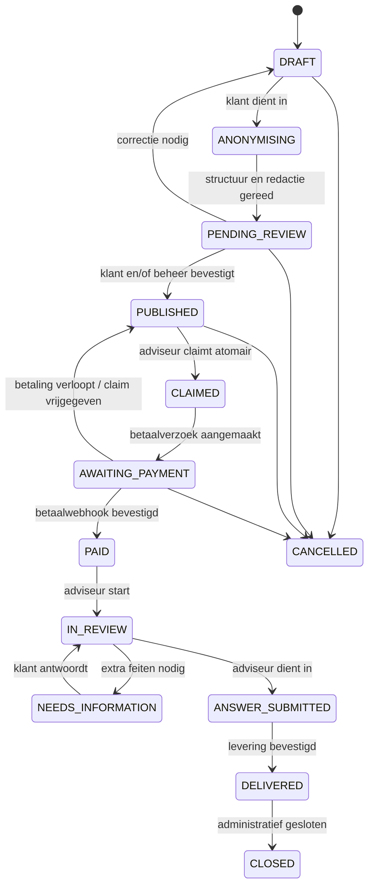
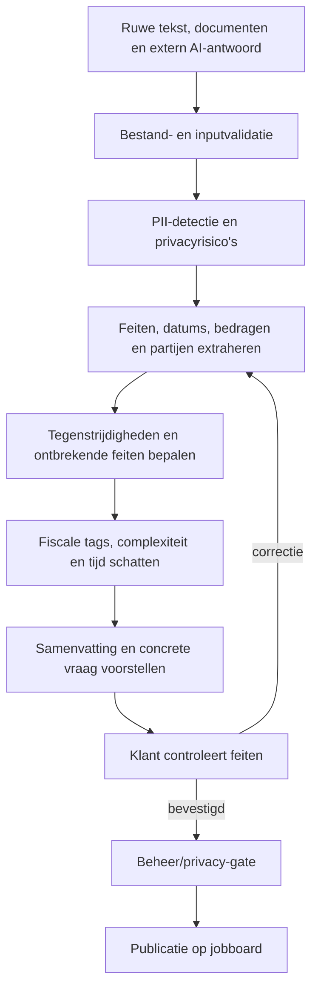

# Architectuurblauwdruk — Fiscaal adviesplatform

Status: richtinggevend ontwerp  
Versie: 1.0  
Datum: 22 september 2026

## 1. Doel van dit document

Dit document beschrijft de samenhang van het volledige platform: productrollen, domeinen, data, statussen, frontend, backend, privacy, AI, matching, betalingen, documenten, deployment en teststrategie.

De blauwdruk maakt steeds onderscheid tussen:

- **publieke demo**: de huidige statische GitHub Pages-interface met fictieve data;
- **lokale MVP**: frontend plus lokale FastAPI-backend en SQLite;
- **productieplatform**: beveiligde hosting, echte authenticatie, database, betalingen en documentopslag.

De publieke demo mag nooit echte fiscale dossiers of persoonsgegevens verwerken.

## 2. Productdefinitie

Het platform is geen chatbot. Het is een gecontroleerde fiscale marketplace waarin:

1. een klant ongestructureerde informatie aanlevert;
2. het platform de informatie structureert en anonimiseert;
3. de klant de feitelijke structuur bevestigt;
4. een opdracht op een jobboard wordt gepubliceerd;
5. een passende adviseur de opdracht accepteert;
6. de klant betaalt;
7. de adviseur AI-output, bronnen en feiten controleert;
8. de klant een menselijk gecontroleerd antwoord ontvangt.

De kernbelofte is: **rommelige klantinput wordt omgezet in een controleerbare fiscale casus, zonder te doen alsof AI zelfstandig fiscaal advies geeft.**

## 3. Architectuurprincipes

1. **Server is gezaghebbend**  
   Statussen, betalingen, claims en definitieve adviezen worden in productie nooit uitsluitend in browserstate bewaard.

2. **Ruwe input en afgeleide informatie blijven gescheiden**  
   Originele klanttekst, gestructureerde feiten, geanonimiseerde tekst, externe AI-output en platform-AI-output zijn afzonderlijke records.

3. **Menselijke controle is een harde poort**  
   AI-output kan nooit direct als definitief fiscaal advies worden geleverd.

4. **Geen bron, geen stellige conclusie**  
   Claims hebben bronverwijzingen, zekerheidsniveau en ontbrekende feiten.

5. **Privacy by design**  
   Adviseurs zien alleen gegevens die noodzakelijk zijn voor beoordeling en uitvoering.

6. **Uitlegbare regels vóór ondoorzichtige ranking**  
   Matching, prijsindicatie en complexiteit starten met controleerbare regels.

7. **Adapters rond externe diensten**  
   AI, betalingen, opslag, authenticatie en notificaties zijn vervangbare interfaces.

8. **Modulaire monoliet vóór microservices**  
   Eén backendapplicatie met domeingrenzen is voor de eerste productfase eenvoudiger te testen, beveiligen en beheren.

9. **Auditbaarheid is onderdeel van het domein**  
   Belangrijke wijzigingen krijgen actor, tijdstip, reden en oude/nieuwe waarde.

10. **Demo en productie zijn verschillende risicoklassen**  
    GitHub Pages is uitsluitend een publieke productdemo.

## 4. Systeemlandschap



### Huidige situatie

- De live GitHub Pages-site bevat een statische Next.js-export.
- Rollen, casussen, betaling en review draaien daar in React client-state.
- Data verdwijnt bij refresh.
- Er is geen echte authenticatie, database, anonimisering of beveiligde opslag.
- De bestaande FastAPI-code is nog niet gekoppeld aan de live frontend.
- De GitHub Pages-workflow publiceert alleen de frontend.

### Doelsituatie

- Frontend consumeert uitsluitend versieerbare REST-endpoints.
- Backend valideert elke statusovergang en autorisatie.
- Database bewaart domeindata en append-only historie.
- Documenten staan privé in objectopslag; nooit in een publieke map.
- Externe diensten zijn via adapters vervangbaar.

## 5. Rollen en autorisatie

### Klant

Mag:

- eigen ruwe input en documenten aanleveren;
- eigen gestructureerde en geanonimiseerde casus controleren;
- ontbrekende vragen beantwoorden;
- eigen betaalverzoek afhandelen;
- eigen definitieve advies en historie bekijken.

Mag niet:

- andere klantcasussen zien;
- ongeanonimiseerde data van anderen zien;
- een gepubliceerde opdracht buiten gecontroleerde correctie wijzigen;
- een expertclaim of reviewstatus aanpassen.

### Adviseur

Mag:

- gepubliceerde geanonimiseerde opdrachten bekijken;
- passende opdracht accepteren;
- na betaling de toegewezen reviewomgeving gebruiken;
- ontbrekende informatie opvragen;
- een definitief advies indienen.

Mag niet:

- originele identificerende klantinput bekijken, tenzij expliciet noodzakelijk en geautoriseerd;
- niet-toegewezen betaalde dossiers openen;
- eigen betaling of platformaudit wijzigen;
- een definitief antwoord indienen zonder verplichte controles.

### Beheerder

Mag:

- anonimisering en structurering controleren;
- publicatie pauzeren, goedkeuren of sluiten;
- adviseurs en specialisaties beheren;
- testbetalingen en statussen beheren;
- auditlogs inzien.

Beheerrechten worden later opgesplitst in support, compliance en platformbeheer als het team groeit.

## 6. Domeinmodules

De backend blijft één deploybare applicatie, maar wordt intern verdeeld in modules.

### 6.1 Identity & Access

Verantwoordelijk voor:

- gebruikersidentiteit;
- rollen en permissies;
- klant- en expertprofielen;
- expertverificatie;
- sessies en auditcontext.

### 6.2 Case Intake

Verantwoordelijk voor:

- ruwe klantinput;
- externe AI-antwoorden;
- documentmetadata;
- gestructureerde feiten;
- concrete adviesvraag;
- bevestiging door de klant.

### 6.3 Privacy & Anonymisation

Verantwoordelijk voor:

- PII-detectie;
- placeholders en redacties;
- handmatige correcties;
- scheiding originele en adviseurzichtbare tekst;
- publicatieblokkade bij onopgeloste privacyrisico's.

### 6.4 Analysis & Evidence

Verantwoordelijk voor:

- casussamenvatting;
- specialisatietags;
- complexiteit en tijdsinschatting;
- AI-conceptantwoord;
- claims, bronnen en zekerheid;
- ontbrekende feiten en tegenstrijdigheden.

### 6.5 Marketplace & Matching

Verantwoordelijk voor:

- jobboardquery's en filters;
- uitlegbare matchscore;
- expertvoorkeuren;
- claimexclusiviteit;
- reactietermijnen en eventuele claim-time-outs.

### 6.6 Payments

Verantwoordelijk voor:

- betaalverzoek na acceptatie;
- providerreferentie;
- webhookverwerking;
- idempotentie;
- refunds en mislukte betalingen;
- scheiding payment status en case status.

### 6.7 Expert Review & Delivery

Verantwoordelijk voor:

- beoordeling per claim of onderdeel;
- correcties en toelichtingen;
- aanvullende klantvragen;
- definitief antwoord;
- levering en sluiting.

### 6.8 Documents

Verantwoordelijk voor:

- private uploads;
- malwarecontrole;
- type- en groottelimieten;
- tijdelijke downloadlinks;
- documenttoegang per rol;
- retentie en verwijdering.

### 6.9 Notifications

Verantwoordelijk voor:

- in-app notificaties;
- e-mailadapter;
- templates;
- voorkeuren;
- retries en afleverstatus.

### 6.10 Administration & Audit

Verantwoordelijk voor:

- statuscorrecties met reden;
- beheeracties;
- auditlog;
- test- en demofuncties;
- operationele dashboards.

## 7. Kerngegevensmodel

### Identiteit

#### User

- `id`
- `email`
- `role`
- `status`
- `auth_provider_id`
- `created_at`
- `updated_at`

#### CustomerProfile

- `user_id`
- `display_name`
- `preferred_contact_method`
- `client_preferences`

#### ExpertProfile

- `user_id`
- `advisor_type`
- `experience_level`
- `minimum_fee`
- `average_response_minutes`
- `active`
- `region`
- `client_type_preferences`
- `complexity_preferences`

#### Specialization / ExpertSpecialization

Normaliseert fiscale disciplines en expertvaardigheden. Tags worden niet als vrije tekst gebruikt voor kritieke matchingregels.

### Intake en structurering

#### Case

- `id`
- `customer_id`
- `title`
- `category`
- `client_type`
- `tax_year`
- `urgency`
- `complexity`
- `estimated_minutes_min`
- `estimated_minutes_max`
- `offered_fee_cents`
- `deadline`
- `status`
- `created_at`
- `updated_at`
- `published_at`
- `claimed_at`
- `answered_at`
- `version`

`version` ondersteunt optimistic locking zodat twee acties niet stilzwijgend dezelfde status overschrijven.

#### RawCaseInput

- `case_id`
- `raw_text_encrypted`
- `submitted_by`
- `submitted_at`
- `input_version`

#### ExternalAIAnswer

- `case_id`
- `provider_label`
- `answer_text`
- `supplied_by_customer`
- `created_at`
- `assessment_status`

Dit record is nooit hetzelfde als het platform-AI-antwoord.

#### StructuredFact

- `case_id`
- `fact_type`
- `label`
- `value`
- `source_type` (`CUSTOMER_TEXT`, `DOCUMENT`, `EXTERNAL_AI`, `DERIVED`)
- `source_reference`
- `confidence`
- `customer_confirmation`
- `required_for_advice`

#### CaseIssue

- `case_id`
- `issue_type` (`MISSING_FACT`, `CONTRADICTION`, `PRIVACY_RISK`, `UNSUPPORTED_CLAIM`)
- `severity`
- `description`
- `resolution_status`
- `resolved_by`
- `resolved_at`

#### CaseSummary

- `case_id`
- `short_title`
- `summary`
- `concrete_question`
- `urgency`
- `generated_by`
- `confirmed_at`

#### AnonymizedCase

- `case_id`
- `anonymized_text`
- `redaction_map_encrypted`
- `review_status`
- `reviewed_by`
- `published_version`

De redaction map is alleen voor geautoriseerde beheerfuncties beschikbaar.

### Analyse en bronnen

#### AIAnswer

- `case_id`
- `provider`
- `model`
- `prompt_version`
- `answer_text`
- `status`
- `generated_at`

#### AIClaim

- `ai_answer_id`
- `claim_text`
- `certainty`
- `requires_missing_fact`
- `review_status`

#### Source

- `title`
- `source_type`
- `citation`
- `version_or_date`
- `url`
- `official`
- `demo_only`

#### AIClaimSource

Koppelt conclusies aan één of meerdere bronnen. Zonder bron mag een claim niet als hoog-zeker worden gemarkeerd.

### Marketplace, betaling en review

#### ExpertClaim

- `case_id`
- `expert_id`
- `claimed_at`
- `expires_at`
- `status`

#### Payment

- `case_id`
- `customer_id`
- `amount_cents`
- `currency`
- `provider`
- `provider_reference`
- `status`
- `idempotency_key`
- `paid_at`
- `refunded_at`

#### ExpertReview

- `case_id`
- `expert_id`
- `overall_status`
- `final_answer`
- `customer_explanation`
- `submitted_at`

#### ExpertReviewItem

- `review_id`
- `claim_id`
- `assessment`
- `explanation`
- `correction`
- `source_verified`

### Ondersteunende data

#### CaseDocument

- documentmetadata en private storage key;
- geen publiek bestandspad;
- toegang en retentie apart vastgelegd.

#### CaseStatusHistory

Append-only historie van statusovergangen.

#### AuditLog

- actor;
- actie;
- objecttype en object-id;
- oude en nieuwe waarde waar passend;
- reden;
- request/correlation id;
- timestamp.

Auditlogs bevatten geen volledige fiscale teksten of documenten.

#### Notification

Bevat kanaal, template, geadresseerde, afleverstatus en retry-informatie.

## 8. Relaties op hoofdlijnen



## 9. Casusstatusmachine



### Regels

- Statusovergangen gebeuren via domeincommands, niet via een generieke `PATCH status`.
- Elke overgang heeft actor, reden, timestamp en toegestane vorige status.
- Claim is atomair; twee adviseurs kunnen niet dezelfde opdracht verkrijgen.
- `PAID` wordt alleen gezet na een geldige providerwebhook of expliciete mockactie in een testomgeving.
- `ANSWER_SUBMITTED` vereist afgeronde reviewchecks en een definitief antwoord.
- Correcties achteraf maken een nieuwe versie; historie wordt niet overschreven.

## 10. Intake- en analysepipeline



### Belangrijke grens

De klant bevestigt feiten en context, niet de fiscale conclusie. Een adviseur bevestigt of corrigeert de fiscale analyse.

### AI-adapter

```text
AIProvider
├── structure_case(input) -> StructuredCaseResult
├── classify_case(input) -> ClassificationResult
├── draft_answer(input, sources) -> DraftAnswerResult
└── assess_external_answer(input) -> ExternalAnswerAssessment
```

Implementaties:

- `MockAIProvider`: voorspelbare seed-output voor demo en tests;
- toekomstige productieprovider achter dezelfde interface.

Elke uitvoer bewaart provider, model, promptversie en generatiecontext.

## 11. Anonimiseringsarchitectuur

De eerste laag is deterministisch en lokaal/server-side:

- e-mailadressen;
- telefoonnummers;
- postcodes en adressen;
- BSN-achtige nummers;
- KvK-nummers;
- IBAN's;
- expliciet gelabelde namen en bedrijfsnamen.

Daarna kan een AI-laag contextuele entiteiten voorstellen. AI-redacties worden niet automatisch vertrouwd bij hoge risico's.

### Redactieobject

```json
{
  "start": 18,
  "end": 34,
  "entity_type": "PERSON",
  "replacement": "[PERSOON]",
  "confidence": 0.98,
  "detector": "regex_or_ner",
  "review_status": "PENDING"
}
```

### Publicatie-gate

Publicatie wordt geblokkeerd wanneer:

- een hoog risico niet is opgelost;
- origineel en geanonimiseerd document onvoldoende gescheiden zijn;
- noodzakelijke fiscale informatie per ongeluk is verwijderd;
- de klant de feitelijke samenvatting nog niet heeft bevestigd.

## 12. Matching en prijsindicatie

De eerste matching is regelgebaseerd.

Voorbeeldweging:

| Factor | Gewicht |
|---|---:|
| Hoofdcategorie | 30 |
| Specialisatietags | 25 |
| Type klant | 10 |
| Complexiteitsvoorkeur | 10 |
| Belastingjaar/actualiteit | 5 |
| Urgentie versus beschikbaarheid | 10 |
| Geschatte tijd versus voorkeur | 10 |

De UI toont naast het percentage de bijdragende regels. Hardcoded percentages zijn alleen toegestaan in seed-data die expliciet als demo is gemarkeerd.

De vergoeding wordt niet direct door de matchscore bepaald. Een aparte prijsregel gebruikt onder andere complexiteit, geschatte tijd, urgentie en platformmarge.

## 13. Bron- en bewijsmodel

Bronhiërarchie:

1. wet- en regelgeving;
2. beleidsbesluiten;
3. parlementaire geschiedenis;
4. jurisprudentie;
5. officiële uitvoeringsinformatie;
6. vakliteratuur en commentaar.

Per conclusie worden vastgelegd:

- claim;
- bron;
- bronsoort;
- datum of versie;
- zekerheid;
- relevante ontbrekende feiten;
- verificatiestatus door adviseur.

Demo-bronnen krijgen `demo_only = true` en worden zichtbaar als niet juridisch gecontroleerd gemarkeerd.

## 14. API-ontwerp

Basis: `/api/v1` met JSON REST-resources en OpenAPI-documentatie.

### Intake

```text
POST   /cases
GET    /cases/{case_id}
POST   /cases/{case_id}/inputs
POST   /cases/{case_id}/documents
POST   /cases/{case_id}/structure
POST   /cases/{case_id}/confirm-structure
GET    /cases/{case_id}/anonymisation-preview
POST   /cases/{case_id}/confirm-anonymisation
```

### Jobboard en matching

```text
GET    /jobboard
GET    /jobboard/{case_id}
GET    /jobboard/{case_id}/match
POST   /jobboard/{case_id}/claim
DELETE /jobboard/{case_id}/claim
```

### Betaling

```text
POST   /cases/{case_id}/payment-intent
POST   /payments/webhooks/{provider}
GET    /cases/{case_id}/payment
POST   /cases/{case_id}/mock-payment   # alleen test/demo
```

### Review en levering

```text
GET    /cases/{case_id}/review
PUT    /cases/{case_id}/review/items/{item_id}
POST   /cases/{case_id}/information-requests
POST   /cases/{case_id}/final-answer
POST   /cases/{case_id}/deliver
```

### Beheer

```text
GET    /admin/cases
POST   /admin/cases/{case_id}/publish
POST   /admin/cases/{case_id}/pause
POST   /admin/cases/{case_id}/close
GET    /admin/audit-logs
GET    /admin/experts
PUT    /admin/experts/{expert_id}
```

Commands ondersteunen een idempotency key bij claim, betaling, webhook en levering.

## 15. Frontendarchitectuur

### Doelstructuur

```text
frontend/
├── app/
│   ├── (public)/
│   ├── customer/
│   │   ├── cases/
│   │   └── intake/
│   ├── expert/
│   │   ├── jobboard/
│   │   └── reviews/
│   ├── admin/
│   └── api-client/
├── components/
│   ├── case/
│   ├── status/
│   ├── evidence/
│   └── forms/
├── lib/
│   ├── api/
│   ├── auth/
│   ├── validation/
│   └── formatting/
└── types/
```

### State

- serverdata via een query/cachelaag;
- formulierstate lokaal per wizardstap;
- rol en sessie via authcontext;
- geen volledige domeindatabase in React `useState`;
- updates via servercommands en invalidatie van relevante queries.

### UX-staten

Elke kernpagina ondersteunt:

- loading/skeleton;
- empty state;
- inline validation;
- fout met herstelactie;
- autorisatiefout;
- verlopen claim/betaling;
- succesvolle bevestiging.

## 16. Backendstructuur

```text
backend/app/
├── api/v1/
├── core/
│   ├── config.py
│   ├── database.py
│   ├── security.py
│   └── logging.py
├── domains/
│   ├── identity/
│   ├── cases/
│   ├── anonymisation/
│   ├── analysis/
│   ├── marketplace/
│   ├── payments/
│   ├── reviews/
│   ├── documents/
│   └── notifications/
├── adapters/
│   ├── ai/
│   ├── auth/
│   ├── payments/
│   ├── storage/
│   └── email/
├── models/
├── schemas/
├── repositories/
├── services/
└── tests/
```

Businessregels leven in domeinservices, niet in routehandlers. Routehandlers doen authenticatie, validatie, command-aanroep en response mapping.

## 17. Transacties en betrouwbaarheid

- Claim en statusovergang gebeuren in één databasetransactie.
- Webhooks worden onder idempotency key verwerkt.
- Externe events worden eerst opgeslagen en daarna verwerkt.
- Notificaties gebruiken later een outboxpatroon om verlies tussen databasecommit en e-mail te voorkomen.
- Lange AI- of documenttaken kunnen later naar een workerqueue; de eerste MVP mag synchroon werken zolang time-outs begrensd zijn.

## 18. Privacy en beveiliging

### Minimumeisen vóór echte gebruikers

- HTTPS;
- sterke authenticatie en sessiebeveiliging;
- rol- en objectniveau-autorisatie;
- encryptie van gevoelige velden en opslag;
- private documenten met tijdelijke URLs;
- secrets buiten Git;
- dependency- en malwarecontrole;
- rate limiting;
- beveiligde logging zonder fiscale teksten;
- backup- en herstelprocedure;
- dataretentie en verwijderflow;
- verwerkersovereenkomsten met providers;
- privacyverklaring en gebruiksvoorwaarden;
- beoordeling van beroepsaansprakelijkheid en platformrol.

### Verboden in de publieke demo

- echte namen;
- BSN, IBAN, KvK of adressen;
- echte loonstroken, aangiften of facturen;
- klantcommunicatie;
- productiecredentials;
- providerwebhooks of echte betalingen.

## 19. Deploymentmodel

### Publieke demo

```text
GitHub main
  -> GitHub Actions
  -> npm ci
  -> Next.js static export
  -> GitHub Pages
```

URL: `https://oli4vos.github.io/Advies-ipc/`

### Lokale MVP

```text
Next.js localhost:3001
FastAPI localhost:8000
SQLite lokaal
lokale/private documentmap
mock AI en mock payment adapters
```

### Productie

Aanbevolen logische opzet:

- frontend op managed webhosting/CDN;
- FastAPI in containerhosting;
- managed PostgreSQL in EU-regio;
- private objectopslag in EU-regio;
- secrets manager;
- centrale logging en error monitoring;
- aparte staging- en productieomgevingen.

De exacte providerkeuze is een open beslissing.

## 20. Configuratie

Voorziene variabelen:

```text
APP_ENV
API_BASE_URL
DATABASE_URL
AUTH_PROVIDER
AUTH_CLIENT_ID
AUTH_CLIENT_SECRET
AI_PROVIDER
AI_MODEL
AI_API_KEY
PAYMENT_PROVIDER
PAYMENT_API_KEY
PAYMENT_WEBHOOK_SECRET
STORAGE_PROVIDER
STORAGE_BUCKET
STORAGE_REGION
EMAIL_PROVIDER
EMAIL_API_KEY
SENTRY_DSN
```

Demo- en productieconfiguratie mogen niet dezelfde credentials of databases gebruiken.

## 21. Teststrategie

### Unit tests

- anonymisatiepatronen en false positives;
- statustransities;
- matchingregels;
- prijsregels;
- bronzekerheid;
- reviewvereisten;
- idempotency.

### Integratietests

- API plus database;
- claimconcurrentie;
- payment webhook;
- documentautorisatie;
- auditlog na commands;
- adapters met testimplementaties.

### End-to-end

1. klant plakt rommelige casus;
2. structuur en privacypreview verschijnen;
3. klant bevestigt;
4. beheer publiceert;
5. adviseur filtert en claimt;
6. klant betaalt;
7. adviseur controleert claims en bronnen;
8. ontbrekende informatie wordt opgevraagd;
9. adviseur levert;
10. klant ziet antwoord en volledige historie.

### Niet-functioneel

- toegankelijkheid;
- mobiel gedrag;
- autorisatietests;
- dependency scanning;
- back-up restore test;
- performance van jobboardfilters;
- logging zonder privacygevoelige payloads.

## 22. Git- en releaseproces

Elke functionele aanpassing krijgt een aparte commit.

Aanbevolen proces:

1. wijziging in de iCloud-projectmap;
2. alleen relevante bestanden stagen;
3. diff en tests controleren;
4. één logisch onderwerp committen;
5. push naar GitHub;
6. GitHub Actions laten bouwen;
7. live GitHub Pages-smoketest uitvoeren;
8. volgende wijziging pas daarna starten.

Commitvoorbeelden:

```text
Fix new-case data isolation
Add anonymisation preview
Require payment before expert review
Document production deployment boundaries
```

Op termijn:

- branch protection op `main`;
- vereiste CI-checks;
- pull requests voor risicovolle wijzigingen;
- automatische dependency updates;
- tagged releases voor staging en productie.

## 23. Gefaseerde realisatie

### Fase 0 — Publieke productdemo

- fictieve data;
- statische GitHub Pages-site;
- klikbare rollen en kernflow;
- harde waarschuwing tegen echte gegevens.

### Fase 1 — Lokale persistente MVP

- FastAPI koppelen;
- SQLite-schema en migraties;
- echte statuscommands;
- regelgebaseerde anonimisering;
- mock AI/payment/storage adapters;
- API- en E2E-tests.

### Fase 2 — Besloten pilot

- echte authenticatie;
- PostgreSQL;
- private objectopslag;
- expertverificatie;
- echte payment sandbox;
- stagingomgeving;
- privacy- en juridische review.

### Fase 3 — Productie

- live betalingen;
- gecontroleerde AI-provider;
- operationele monitoring;
- incident- en herstelprocedures;
- retentie en verwijdering;
- schaalbare notificaties;
- uitbreiding fiscale disciplines.

## 24. Architectuurbeslissingen

### Vastgelegd

- modulaire monoliet;
- REST API;
- Next.js frontend;
- FastAPI backend;
- SQLite lokaal, PostgreSQL voor productie;
- adapters voor externe providers;
- regelgebaseerde matching;
- append-only status- en auditgeschiedenis;
- GitHub Pages uitsluitend voor fictieve frontenddemo;
- één logisch onderwerp per commit.

### Nog te beslissen

1. Is het platform juridisch alleen bemiddelaar, of contractspartij richting klant?
2. Wie is verantwoordelijk voor het uiteindelijke advies en de beroepsaansprakelijkheid?
3. Is een expertclaim exclusief en hoe lang blijft deze zonder betaling geldig?
4. Wat gebeurt er bij afwijzing, refund, no-show of een ondeugdelijk antwoord?
5. Welke authenticatieprovider krijgt de voorkeur?
6. Welke betaalprovider: Mollie of Stripe?
7. Welke AI-provider en welke gegevens mogen daarheen?
8. Welke EU-hosting en documentopslag worden gebruikt?
9. Welke fiscale bronnen mogen juridisch en commercieel worden ontsloten?
10. Wordt communicatie volledig in-platform, per e-mail of gecombineerd?
11. Welke adviseurs mogen meedoen en hoe wordt hun vakbekwaamheid geverifieerd?
12. Welke retentietermijnen gelden voor casussen, documenten, betalingen en auditlogs?

## 25. Definitie van productiegeschikt

Het platform is pas geschikt voor echte casussen als minimaal is voldaan aan:

- backend is server-authoritative;
- echte authenticatie en objectautorisatie werken;
- anonimisering is getest en heeft een menselijke gate;
- documenten zijn privé en gecontroleerd;
- betaling en webhooks zijn idempotent;
- alle statusovergangen zijn gevalideerd en gelogd;
- AI-output is traceerbaar en menselijk gecontroleerd;
- bronnen zijn actueel en verifieerbaar;
- privacy-, contract- en aansprakelijkheidsdocumenten zijn beoordeeld;
- monitoring, backups en incidentherstel zijn ingericht;
- kritieke klant-, expert- en beheerflows hebben end-to-end-tests.

Tot dat moment blijft de GitHub Pages-versie een publieke demonstratie met uitsluitend fictieve data.
